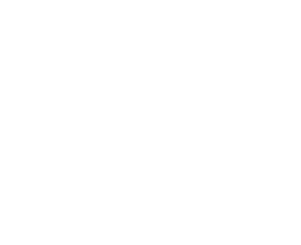
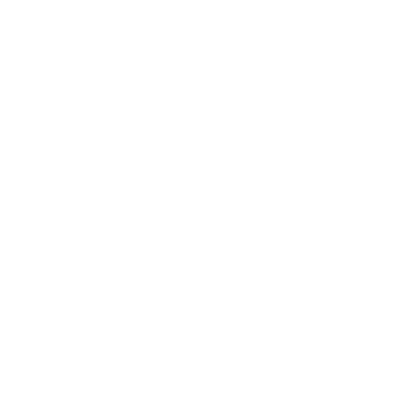
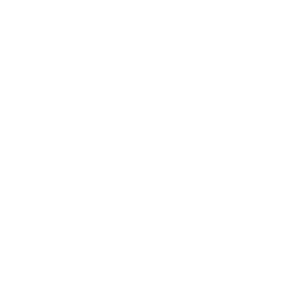

<link
  rel="stylesheet"
  href="stylesheets/graph.css"
/>

<!-- Prepare a container for your calendar. -->

<link type="text/css" rel="stylesheet" href="/stylesheets/main.css" />

# Hello! 👋

### About me
- I am an avid iOS engineer with 10+ years of experience who's main focus is building modular and easy to use frameworks in Swift. I have many open source projects you can checkout on my github. 
- My passion is machine learning. I focus on that mainly in my spare time and work on learning as much as I can about the topic. 
- I enjoy hiking and nature photography. 
- I'm a maker.
- B.S. Degree in Toxicology

### Career
#### Past
- Elite Daily - iOS Engineer / Android Engineer 
- Daily Mail - iOS Engineer 

#### Current
- Fox News - Lead Ad Tech iOS Engineer  

# Published Apps 📱

### <a class="custom_link" href="https://apps.apple.com/us/app/nowcast-commuter-weather/id1501885597" > Nowcast - commuter weather</a>
- Nowcast provides you with instant access to your commuter weather. It is a simple yet very effective app. You can set two time slots in which you would like weather to display. It will show you brief yet informative weather information for each of those times.

- It is perfect for the busy commuter looking to quickly decide on an outfit before leaving for work.

# Projects 📝
### <a href="https://github.com/wvabrinskas/Neuron">Neuron</a>
  - Neuron is a swift package I developed to help learn how to make neural networks. It is far from perfect and I am still learning. There is A LOT to learn here and I've just scratched the surface. As of right now this package provides a way to get started in machine learning completely in Swift.
  - Swift package support

### <a href="https://github.com/wvabrinskas/Genetic">Genetic</a>
  - Genetic is a swift package that makes it incredibly simple to include the Genetic Algorithm within a project.
  - Swift package support

### <a href="https://github.com/wvabrinskas/Jumpiter">Jumpiter</a>
  - A macOS app that utilizes my Neuron and Genetic swift packages to play a simple game all on its own.

### <a href="https://github.com/wvabrinskas/SimpleApiClient">SimpleApiClient</a>
  - The most bare-bones api client you can imagine in Swift.
  - Swift package support

### <a href="https://github.com/wvabrinskas/FareyAlgorithm">FareyAlgorithm</a>
  - "In mathematics, the Farey sequence of order n is the sequence of completely reduced fractions, either between 0 and 1, or without this restriction,[a] which when in lowest terms have denominators less than or equal to n, arranged in order of increasing size. With the restricted definition, each Farey sequence starts with the value 0, denoted by the fraction 0/1, and ends with the value 1, denoted by the fraction 1/1 (although some authors omit these terms)."

### <a href="https://github.com/wvabrinskas/Swift-CLI-Password-Generator">Swift-CLI-Password-Generator</a>
  - Generate passwords using the cli. Completely written in swift.

### <a href="https://github.com/wvabrinskas/Avatar">Avatar</a>
  - Generate random user Avatars for apps.
  - Cocoapods support

# Jailbreak Development
### <a href="https://repo.packix.com/package/com.irepo.boxy4/">Boxy 4</a> (and all previous versions)
- Fully customize your icon layout on the iOS Springboard. You can adjust how far each icon is from each edge of the screen and how far each icon is from one another. These combinations can provide some pretty cool layouts. If you aren't the creative type or don't want to be bothered with testing each setting, there are presets available for you to choose from. You can align you icons in the the top half of the screen or the bottom half or even the top corners of the screen.
- <a href="https://www.idownloadblog.com/2020/01/13/boxy-4/">Review on iDownloadBlog</a>

# Talks
- <a href="https://www.youtube.com/watch?v=s-vqn6H2nG4">(Jail)Breaking into Professional iOS Development - Jailbreakers Unite 2017</a>
- <a href="https://www.youtube.com/watch?v=GU7tBmTYsQ8">Post development and customer service - WWJC 2015</a>

# Interviews
- <a href="https://pocketfullofapps.com/2015/02/12/developer-spotlight-william-vabrinskas-part-one.html">Developer Spotlight: William Vabrinskas - 2015</a>