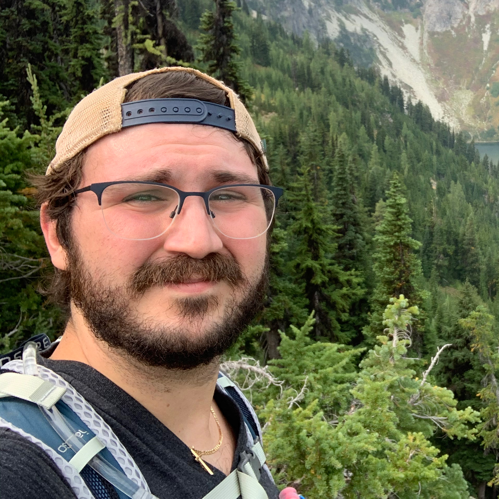

<link
  rel="stylesheet"
  href="stylesheets/graph.css"
/>

<!-- Prepare a container for your calendar. -->

<link type="text/css" rel="stylesheet" href="/stylesheets/main.css" />

# Hello! 👋

### About me
- I am an avid iOS engineer with 10+ years of experience who's main focus is building modular and easy to use frameworks in Swift. I have many open source projects you can checkout on my github. 
- My passion is machine learning. I focus on that mainly in my spare time and work on learning as much as I can about the topic. 
- I enjoy hiking and nature photography. 
- I'm a maker.
- B.S. Degree in Toxicology

### Career

#### Current
- Apple - Senior iOS Engineer

#### Past
- Uber - Senior iOS Engineer 
- Fox News - Lead Ad Tech iOS Engineer  
- Daily Mail - iOS Engineer 
- Elite Daily - iOS Engineer / Android Engineer 
